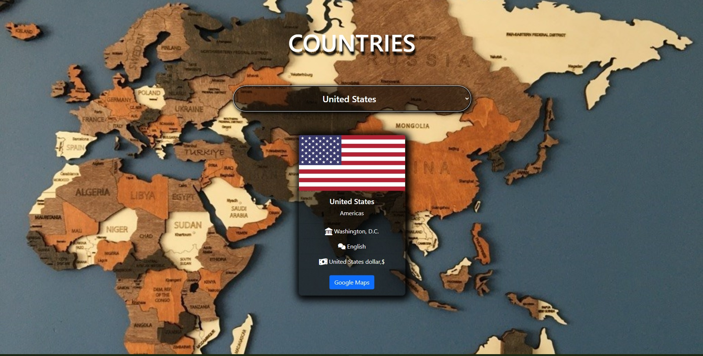

<p align="center">
<a href="https://www.linkedin.com/in/ozkankomu/" target="_blank"></a>
</p>


# Project : country - App
## Table of contents

  - [The challenge](#the-challenge)
  - [Screenshot](#screenshot)
  - [Project Skeleton ](#project-skeleton)
  - [Links](#links)
  - [Built with](#built-with)
  - [Useful resources](#useful-resources)
- [Author](#author)


## The challenge
The aim of the project is to publish the information of the countries with the card structure by extracting data from the API.


## Project Skeleton 

```
country - App

|----README.md                   
|----images      
     | photos...
|----index.html  
|----style.css   

```

## Screenshot
<p align="center">
<a href="https://ozkankomu.github.io/country-app/"></a>
</p>


## Links
<hr>
<b>Check The Live Website ➡️</b> <a href="https://ozkankomu.github.io/country-app/">Live Website</a>
<hr>

### Built with
- js DOM Manipulation
- Semantic HTML5 markup
- CSS custom properties
- Flexbox
- CSS Grid
- Mobile-first workflow
- JS DOM Manipulation	
- Api Sevices


## Notes

- I used HTML, CSS , JavaScript to complete this project.

### Useful resources

- [W3 Schoold](https://www.w3schools.com/) - This helped me for basics of website paradigm. I really liked this pattern and will use it going forward.
- [MDN](https://developer.mozilla.org/en-US/) - This is an amazing document which helped me finally understand deep sides of web development. I'd recommend it to anyone still learning these concepts.


## Author

- Author - [Ozkan]

<center> &#8987; Happy Coding  &#9997; </center>
